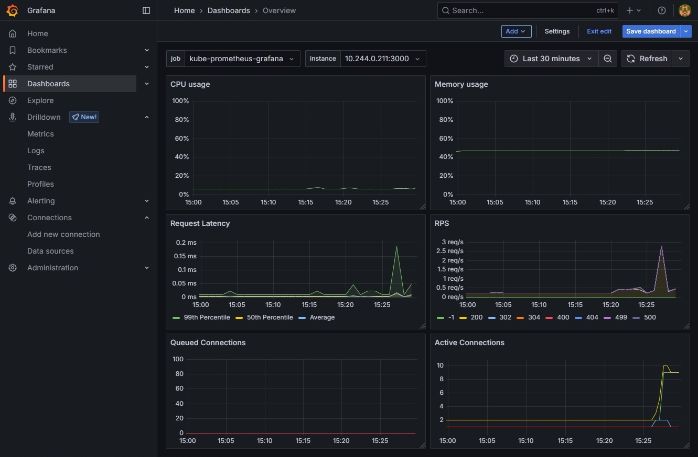

# Tapir Chess

Tapir Chess is a chess platform written in C#/.NET 8 + Vue.js, aiming to learn more about modern technologies, patterns (CQRS, Domain-Driven Design, Event Sourcing), containerization (Docker, Docker Compose) and deployment (Kubernetes). The project uses microservices architecture as a basis, splitting features into a few easily scalable main areas of responsibility.

## Table of Contents

- [General Architecture](#general-architecture)
  - [Frontend](#frontend)
  - [Core](#core)
  - [Gateway](#gateway)
  - [Identity](#identity)
  - [Providers](#providers)
  - [Services](#services)
- [Service Architecture](#service-architecture)
  - [API](#api)
  - [Application](#application)
  - [Domain](#domain)
  - [Infrastructure](#infrastructure)
- [Persistence](#persistence)
  - [Write Model](#write-model)
  - [Read Model](#read-model)
  - [Rebuilding](#rebuilding)
- [WebSocket](#websocket)
- [Deployment](#deployment)
  - [Cluster Architecture](#cluster-architecture)
  - [Storage](#storage)
  - [Monitoring](#monitoring)
  - [Logs](#logs)
  - [Backups](#backups)

## General Architecture


### Frontend

[Tapir Chess frontend](/ui/) is written in TypeScript using [Vue.js](https://vuejs.org/) as the backbone, [Tailwind CSS](https://tailwindcss.com/) with [daisyUI](https://daisyui.com/) plugin as the styling framework and other dependencies as follows.

- [Pinia](https://pinia.vuejs.org/) - state management and stores
- [Axios](https://axios-http.com) - promise-based HTTP client
- [Moment.js](https://momentjs.com/) - time parsing and manipulation
- [chess.js](https://github.com/jhlywa/chess.js) - chess moves generation and validation
- [mitt](https://github.com/developit/mitt) - simple event emitter

### Core

[Tapir.Core](/src/Tapir.Core/) project contains abstraction and logic shared by all providers and services: common interfaces, Domain-Driven Design base classes, event bus, integration messages, validation and other utilities.

### Gateway

[Tapir.Gateway](/src/Tapir.Gateway/) acts as a single entry point to the backend, authorizes requests and forwards them to appropriate services. Written using [YARP](https://github.com/dotnet/yarp), a fast reverse proxy toolkit.

### Identity

[Tapir.Identity](/src/Tapir.Identity.API/) manages authentication/authorization of users and also provides a set of the most common endpoints to manage an account. It's based on [ASP.NET Core Identity](https://learn.microsoft.com/en-us/aspnet/core/security/authentication/identity), backed by [Entity Framework Core](https://learn.microsoft.com/en-us/ef/core/) and [JWT Bearer](https://learn.microsoft.com/en-us/aspnet/core/security/authentication/configure-jwt-bearer-authentication).

### Services

Tapir Chess services have been divided with the though of achieving the best isolation and scalability while maintaining the ease of work on them. They all share the same core and message broker but use separate databases or event stores. Each service is implemented using CQRS, Domain-Driven Design and Event Sourcing.

- [Tapir.Services.Games](/src/Tapir.Services.Games.API) - matchmaking and matches, chess rules validation
- [Tapir.Services.News](/src/Tapir.Services.News.API) - publishing, updating and retrieving news
- [Tapir.Services.Players](/src/Tapir.Services.Players.API) - player profiles, ratings, statistics

### Providers

Each integration with database, event store, message bus or other third-party software is implemented by provider projects, common interfaces are stored in [Tapir.Core](/src/Tapir.Core/) and can be injected in every service as needed.
- [Tapir.Providers.Chess.PaxChess](/src/Tapir.Providers.Chess.PaxChess) - chess library provided by [pax.chess](https://github.com/ipax77/pax.chess)
- [Tapir.Providers.Database.PostgreSQL](/src/Tapir.Providers.Database.PostgreSQL) - relational database provided by [PostgreSQL](https://www.postgresql.org.pl/)
- [Tapir.Providers.EventStore.MongoDB](/src/Tapir.Providers.EventStore.MongoDB) - event store provided by [MongoDB](https://www.mongodb.com/)
- [Tapir.Providers.Mailing.MailKit](/src/Tapir.Providers.Mailing.MailKit) - SMTP client provided by [MailKit](https://github.com/jstedfast/MailKit)
- [Tapir.Providers.MessageBus.RabbitMQ](/src/Tapir.Providers.MessageBus.RabbitMQ) - message broker provided by [RabbitMQ](https://www.rabbitmq.com/)
- [Tapir.Providers.Scheduler.Quartz](/src/Tapir.Providers.Scheduler.Quartz) - task scheduler provided by [Quartz](https://www.quartz-scheduler.net/)

## Service Architecture

The structure of each Tapir service is based on Clean Architecture principles, dividing code into four separate projects.


### API

The API project contains controllers and in some cases also WebSocket hubs. Each HTTP request is validated and mapped into a command or query, then processed by the corresponding handler injected directly into the controller's method. A simplified example might look like a snippet below.

```csharp
[ApiController]
[Route("api/[controller]")]
public class AccountController : ControllerBase
{
    [HttpPost]
    [Route("info")]
    [Produces("application/json")]
    [ProducesResponseType(typeof(PagedResult<GetAccountQueryResult>), StatusCodes.Status200OK)]
    [ProducesResponseType(typeof(ProblemDetails), StatusCodes.Status400BadRequest)]
    public async Task<IActionResult> Info(GetAccountQuery query, [FromServices] IGetAccountQueryHandler handler)
    {
        return Ok(await handler.Process(query, User));
    }
}
```

Utilizing built-in [[FromServices]](https://learn.microsoft.com/en-us/aspnet/core/mvc/controllers/dependency-injection?view=aspnetcore-9.0#action-injection-with-fromservices) instead of libraries like [MediatR](https://github.com/jbogard/MediatR) reduces number of layers and simplifies navigation through code. 

### Application

The Application project is essentially built with four main components: commands, queries, projectors and tasks. Commands (with their corresponding handlers) interact with domain aggregates and repositories (in the form of event stores) while usually not returning any data except identificators of newly created instances. The basic command handler for creating a news might look like below.

```csharp
public class CreateNewsCommand
{
    public required string Title { get; set; }
    public required string Alias { get; set; }
    public required string Content { get; set; }
}

public class CreateNewsCommandResult
{
    public Guid Id { get; set; }
}

public interface ICreateNewsCommandHandler : ICommandHandler<CreateNewsCommand, CreateNewsCommandResult>
{

}

public class CreateNewsCommandHandler : ICreateNewsCommandHandler
{
    private readonly IAggregateRepository<NewsEntity> _newsRepository;

    public CreateNewsCommandHandler(IAggregateRepository<NewsEntity> newsRepository)
    {
        _newsRepository = newsRepository;
    }

    public async Task<CreateNewsCommandResult> Process(CreateNewsCommand command, ClaimsPrincipal? user)
    {
        var entity = new NewsEntity(Guid.NewGuid());

        entity.SetTitle(command.Title);
        entity.SetAlias(command.Alias);
        entity.SetContent(command.Content);

        await _newsRepository.Save(entity);

        return new CreateNewsCommandResult
        {
            Id = entity.Id
        };
    }
}
```

Queries have a similar structure, except they don't have any knowledge about DDD aggregates/repositories and instead read directly from an eventually consistent relational database. The result is mapped into Data Transfer Objects whose structures are prepared to be directly returned by controllers, so there are no additional mappings in between. The query for reading a list of news can be as follows.

```csharp
public class GetNewsListQuery
{
    public required int PageNumber { get; set; }
    public required int PageSize { get; set; }
}

public interface IGetNewsListQueryHandler : ICommandHandler<GetNewsListQuery, PagedResult<NewsDto>>
{

}

public class GetNewsListQueryHandler : IGetNewsListQueryHandler
{
    private readonly IDatabaseConnection _database;

    public GetNewsListQueryHandler(IDatabaseConnection database)
    {
        _database = database;
    }

    public async Task<PagedResult<NewsDto>> Process(GetNewsListQuery query, ClaimsPrincipal? user)
    {
        using (var connection = _database.Open())
        {
            var totalCount = await connection.ExecuteScalarAsync<int>("SELECT COUNT(*) FROM News WHERE Deleted = false");
            var news = await connection.QueryAsync<NewsDto>("SELECT * FROM News WHERE Deleted = false ORDER BY CreatedAt DESC LIMIT @Limit OFFSET @Offset", new
            {
                Limit = query.PageSize,
                Offset = (query.PageNumber - 1) * query.PageSize,
            });

            return new PagedResult<NewsDto>
            {
                Items = news.ToList(),
                PageNumber = query.PageNumber,
                PageSize = query.PageSize,
                TotalCount = totalCount
            };
        }
    }
}
```

Projectors act as a bridge between read and write models (or relational database and event store in this case) - change in domain entity creates new events which are then processed by their corresponding handlers like the one below. This way of decoupling makes it easy to rebuild the read model if necessary by simply replaying all events. SQL commands are idempotent, which means that calling the projector for the same event multiple times won't change the data itself, which might be important in scenarios like read model rebuild.

```csharp
public class NewsContentUpdatedProjector : IEventHandler<NewsContentUpdatedEvent>
{
    private readonly IDatabaseConnection _database;

    public NewsContentUpdatedProjector(IDatabaseConnection database)
    {
        _database = database;
    }

    public async Task Process(NewsContentUpdatedEvent @event)
    {
        using (var connection = _database.Open())
        {
            await connection.ExecuteAsync("UPDATE News SET Content = @Content, UpdatedAt = NOW() WHERE Id = @AggregateId", new
            {
                @event.Content,
                @event.AggregateId,
            });
        }
    }
}
```

The last important part of the Application project are tasks. Essentially every service will have at least one that runs a domain event synchronizer to maintain consistency between the read and write model, by retrieving newly created events and calling their projectors.

```csharp
public class ReadModelSynchronizationTask : ITask
{
    private readonly IDomainEventSynchronizer _synchronizer;

    public ReadModelSynchronizationTask(IDomainEventSynchronizer? synchronizer = null)
    {
        _synchronizer = synchronizer!;
    }

    public async Task Run()
    {
        await _synchronizer.PublishEvents();
    }
}
```

### Domain

The Domain project represents a core logic and is done based on Domain-Driven Design principles. Every service represents a bounded context with a set of relevant aggregates, entities, value objects, events and repositories. The simplified structure of a news aggregate entity might look like below - `ApplyUncommittedEvent` adds a newly created event to the internal list which at a later stage is read by the corresponding repository and persisted in the event store. Entities have no external dependencies, which makes them easy to unit test.

```csharp
public class NewsEntity : AggregateRoot
{
    public DateTime CreatedAt { get; private set; }
    public string? Content { get; private set; }

    public NewsEntity()
    {

    }

    public NewsEntity(Guid id)
    {
        var @event = new NewsCreatedEvent(id, DateTime.UtcNow);

        ApplyEvent(@event);
        ApplyUncommittedEvent(@event);
    }

    public void SetContent(string content)
    {
        if (string.IsNullOrEmpty(content))
        {
            throw new DomainException("Content is required.", "EmptyContent");
        }

        var @event = new NewsContentUpdatedEvent(Id, content);

        ApplyEvent(@event);
        ApplyUncommittedEvent(@event);
    }

    public override void ApplyEvent(DomainEvent @event)
    {
        switch (@event)
        {
            case NewsCreatedEvent newsCreatedEvent: ExecuteEvent(newsCreatedEvent); break;
            case NewsContentUpdatedEvent contentUpdatedEvent: ExecuteEvent(contentUpdatedEvent); break;
        }

        base.ApplyEvent(@event);
    }

    private void ExecuteEvent(NewsCreatedEvent @event)
    {
        Id = @event.AggregateId;
        CreatedAt = @event.CreatedAt;
    }

    private void ExecuteEvent(NewsContentUpdatedEvent @event)
    {
        Content = @event.Content;
    }
}
```

### Infrastructure

The Infrastructure project initializes the Dependency Injection Container with all necessary providers, authentication and logging. Usually, there is also `Migrations` directory with all necessary SQL scripts to initialize read model and task scheduler tables.

## Persistence


### Write Model

When the command is processed by the corresponding handler, the appropriate repository is injected into the constructor to allow operations on business entities. Loading an aggregate is done by calling `Load` method which reads events from the event store and applies them to the instance.

```csharp
public async Task<TRoot> Load(Guid id)
{
    var events = await _eventStore.GetByAggregateId(id);

    if (events.Count == 0)
    {
        throw new AggregateNotFoundException($"Aggregate {id} not found.");
    }

    if (Activator.CreateInstance(typeof(TRoot)) is not TRoot entity)
    {
        throw new InvalidOperationException($"Aggregate root {typeof(TRoot).Name} could not be instantiated.");
    }

    foreach (var @event in events)
    {
        entity.ApplyEvent(@event);
    }

    return entity;
}
```

Changes in entities generate events that must be persisted in the next step - this is done by the repository's method `Save` which atomically writes them into the event store. To ensure that no other command changed the entity which could potentially lead to an erroneous state, [Optimistic Concurrency Control](https://en.wikipedia.org/wiki/Optimistic_concurrency_control) is implemented. If a concurrent write has happened, the aggregate with fresh state is loaded and all events are applied again. In the situation where some event is not valid anymore, `AggregateConcurrentWriteException` is thrown and changes are not saved.

```csharp
public async Task Save(TRoot entity)
{
    var events = entity.GetUncommittedEvents();
    var expectedVersion = entity.Version - events.Count;

    for (var i = 0; i < 10; i++)
    {
        if (!await _eventStore.AddAsync(entity.Id, events, expectedVersion))
        {
            entity = await Load(entity.Id);

            foreach (var @event in events)
            {
                entity.ApplyEvent(@event);
            }

            expectedVersion = entity.Version - events.Count;
        }
        else
        {
            entity.ClearUncommittedEvents();
            return;
        }
    }

    throw new AggregateConcurrentWriteException("Aggregate was modified by another process.");
}
```

### Read Model

Events while being persisted in the event store still have to be synchronized with the read model. This is done by periodically calling `PublishEvents` method which retrieves the newest events and calls their corresponding projectors through the event bus. To ensure that the last synchronization time is not prone to concurrent write by multiple tasks, [Optimistic Concurrency Control](https://en.wikipedia.org/wiki/Optimistic_concurrency_control) is used here.

The same method is run when the read model is rebuilding, except the time window covers all events and setting the last synchronization time is forced - this might cause some projector calls to be duplicated, but thanks to their idempotent nature it doesn't have negative effects.

```csharp
public async Task PublishEvents(bool rebuild = false)
{
    var from = DateTime.MinValue;
    var to = DateTime.UtcNow.AddSeconds(-1);
    var lastSynchronizationTime = await _eventStore.GetLastSynchronizationTime() ?? DateTime.MinValue;

    if (!rebuild)
    {
        from = lastSynchronizationTime;
    }

    do
    {
        foreach (var @event in await _eventStore.GetByTimestamp(from, to))
        {
            try
            {
                if (rebuild)
                {
                    @event.MarkAsReplay();
                }

                await _eventBus.Send(@event);
            }
            catch (Exception ex)
            {
                _logger.LogError(ex, $"Failed to publish event {@event.Id} from aggregate {@event.AggregateId}");
            }
        }

        from = to;
        to = DateTime.UtcNow.AddSeconds(-1);
    }
    // In case when processing events took a long time and `from` is not fresh anymore
    while ((DateTime.UtcNow - from).TotalSeconds > 5);

    if (rebuild)
    {
        await _eventStore.SetLastSynchronizationTime(to);
    }
    else
    {
        if (!await _eventStore.SetLastSynchronizationTime(to, lastSynchronizationTime))
        {
            _logger.LogError($"Concurrent write detected while setting last synchronization time");
        }
    }
}
```

### Rebuilding

An important feature of event sourcing is the ability to rebuild the read model from scratch by replaying all events and their corresponding projectors. To prevent service from being unavailable while running the migration, a blue-green deployment strategy is used with the following steps.

1. Temporary (blue) tables are created and marked with `_Rebuild` suffix with their schema is duplicated from green (live) tables.
2. Synchronizer runs projectors for all events from the past and ends operation if the timestamp of the latest processing event is fresh.
3. Blue and green tables are swapped.

Both database operations in 1 and 3 are wrapped in transactions, so the system is not left in an undefined state if any issue happens during the operation.

```csharp
public async Task Run()
{
    using (var connection = await _database.Open())
    {
        using (var transaction = connection.BeginTransaction())
        {
            await connection.ExecuteAsync($"DROP TABLE IF EXISTS Players_Rebuild", null, transaction);
            await connection.ExecuteAsync($"CREATE TABLE IF NOT EXISTS Players_Rebuild (LIKE Players INCLUDING ALL)", null, transaction);

            transaction.Commit();
        }
    }

    await _synchronizer.PublishEvents(true);

    using (var connection = await _database.Open())
    {
        using (var transaction = connection.BeginTransaction())
        {
            await connection.ExecuteAsync($"ALTER TABLE Players RENAME TO Players_{DateTime.UtcNow:yyyyMMddHHmmss}", null, transaction);
            await connection.ExecuteAsync($"ALTER TABLE Players_Rebuild RENAME TO Players", null, transaction);

            transaction.Commit();
        }
    }
}
```

## WebSocket

Playing chess games in real-time requires a two-way communication channel to send moves and receive the ones made by the opponent. [Tapir.Services.Games](/src/Tapir.Services.Games.API) exposes a WebSocket hub through [SignalR](https://github.com/dotnet/aspnetcore/tree/main/src/SignalR) library to which every client is connected after entering the page. A simplified example of processing a new move might look as follows.

```csharp
public class WebSocketHub : Hub
{
    public async Task MakeMove(Guid id, string move, [FromServices] IMakeMoveCommandHandler handler)
    {
        var result = await handler.Process(new MakeMoveCommand
        {
            Id = id,
            Move = move
        }, Context.User);

        var whiteGroup = Clients.Group(result.UserIdWhite.ToString());
        var blackGroup = Clients.Group(result.UserIdBlack.ToString());

        var parameters = new
        {
            id = id,
            move = result.Move,
            moveShort = result.MoveShort,
            side = result.Color,
            timeWhite = result.TimeWhite,
            timeBlack = result.TimeBlack
        };

        await Task.WhenAll(
            whiteGroup.SendAsync("onMoveMade", parameters),
            blackGroup.SendAsync("onMoveMade", parameters)
        );
    }
}
```

Hub methods structure-wise are similar to the controllers - command handlers are injected directly into the method by [[FromServices]](https://learn.microsoft.com/en-us/aspnet/core/mvc/controllers/dependency-injection?view=aspnetcore-9.0#action-injection-with-fromservices) and executed. To allow immediate response instead of waiting for read model synchronization, commands are permitted to return necessary data.

## Deployment

### Cluster Architecture


The design of the cluster has been made with the following assumptions.
1. The number of nodes should be low enough to run a whole cluster locally with a set of virtual machines.
2. Control planes and services should be highly available.

The first point has been realized by creating 15 Hyper-V virtual machines, each one containing 2 CPU cores, 2 storages (for operating system and data), 2 network adapters (for NAT and internal network) and memory ranging from 1GB to 2GB (depending on the needs).
- Nodes from 1 to 3 - control planes
- Nodes from 4 to 11 - databases
- Nodes from 12 to 13 - message broker
- Nodes from 14 to 15 or more - services

Networking has been configured using [flannel](https://github.com/flannel-io/flannel) - each node is assigned an address from the 192.168.100.0/24 network and every pod is assigned an address from the 10.244.0.0/16 network. Additionally, load balancer [MetalLB](https://github.com/metallb/metallb) has been installed to allow ingress to get its own IP address from a specified pool.

High availability has been achieved by introducing replicas to all critical components: 3 control plane nodes, 1 replica for every PostgreSQL/MongoDB database, 1 replica for RabbitMQ and at least 1 replica for every service.


To allow easier testing without running a whole cluster, a minikube configuration in the form of [kustomize](https://github.com/kubernetes-sigs/kustomize) overlay has been prepared, which among others disables all replicas to save resources and initialization time.

### Storage


The cluster was designed to run database instances or their replicas only in the specific nodes - this way the data can be stored locally instead of using network solutions that add more latency. Since Kubernetes' [Local Volume Provisioner](https://github.com/kubernetes-sigs/sig-storage-local-static-provisioner) does not support dynamic provisioning, [Local Path Provisioner](https://github.com/rancher/local-path-provisioner) was selected instead.

For storing larger files like backups or logs, an additional virtual machine outside of the cluster has been set. Both [Velero](https://velero.io/) and [Loki](https://github.com/grafana/loki) require S3-compatible object-based storage, which is provided by an instance of [MinIO](https://min.io/).

### Monitoring



Monitoring has been realized using [Prometheus](https://prometheus.io/) as a metrics collector and [Grafana](https://grafana.com/) as a dashboard, with the following data services connected.
- Kubernetes cluster
- PostgreSQL
- MongoDB
- RabbitMQ
- Application services

### Logs


[Grafana](https://grafana.com/) has a built-in integration with [Loki](https://grafana.com/oss/loki/), so that was the choice for log aggregating. While on local machines all logs are saved to a text file, in the cluster [Serilog.Sinks.Grafana.Loki](https://github.com/serilog-contrib/serilog-sinks-grafana-loki) is used instead. Persistence is provided by S3-compatible storage on a dedicated server.

### Backups

Data persisted by databases is stored directly in the nodes and backup has to be periodically made. This is done by [Velero](https://velero.io/) operator connected to S3-compatible storage, which can do it on demand or with specified intervals. 